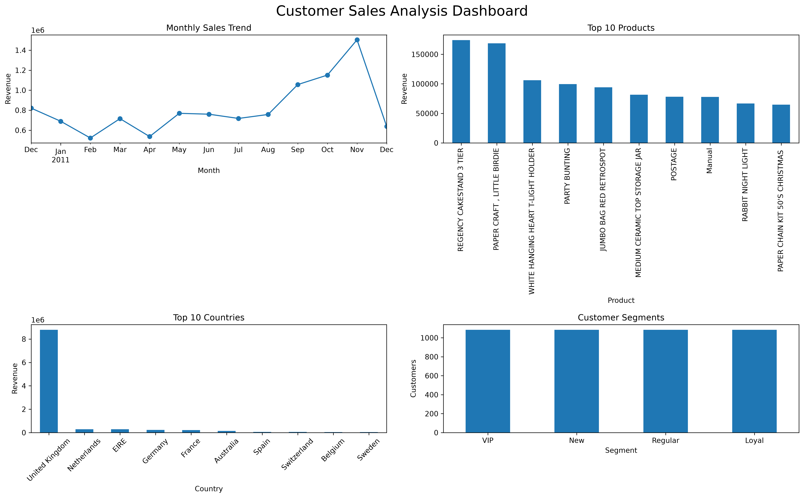

# Customer Sales Analysis & Customer Segmentation

## Project Overview

This project analyzes online retail transaction data to identify sales trends, top-performing products, valuable customers, and customer spending segments.

The goal is to transform raw transaction data into meaningful business insights using Python data analysis techniques.

---

## Dataset

Dataset: Online Retail Dataset

Contains transaction details including:

- Invoice number
- Product information
- Quantity
- Invoice date
- Unit price
- Customer ID
- Country

Dataset size:
- 500,000+ transactions
- 4,000+ customers

---

## Tools & Technologies

- Python
- Pandas
- NumPy
- Matplotlib
- Jupyter Notebook
- VS Code

---

## Data Analysis Process

### 1. Data Cleaning

Performed:

- Removed duplicate records
- Handled missing customer information
- Removed invalid quantities and prices
- Converted date columns into datetime format

---

### 2. Feature Engineering

Created:

- Total Sales = Quantity × Unit Price
- Monthly sales information

---

## Key Analysis

### Sales Performance

Analyzed:

- Total revenue
- Monthly sales trends
- Average order value

### Product Analysis

Identified:

- Top revenue-generating products

### Customer Analysis

Identified:

- Highest-value customers
- Customer spending patterns

### Customer Segmentation

Customers were divided into:

- VIP
- Loyal
- Regular
- New

based on their total spending.

---

## Dashboard

---

## Business Insights

1. The United Kingdom generated the highest revenue, making it the primary market.

2. REGENCY CAKESTAND 3 TIER was the highest revenue-generating product.

3. Customer 14646 was the highest-value customer with spending above 280,000.

4. Customer spending showed a highly skewed distribution, where a small group of customers contributed significant revenue.

5. VIP customers should be targeted with personalized offers and retention strategies.

---

## Project Structure

Customer-Segmentation-Sales-Analysis/

- data/
- notebooks/
- outputs/
- README.md

---

## Conclusion

This project demonstrates an end-to-end data analysis workflow, from data cleaning and exploration to customer segmentation and business insight generation.